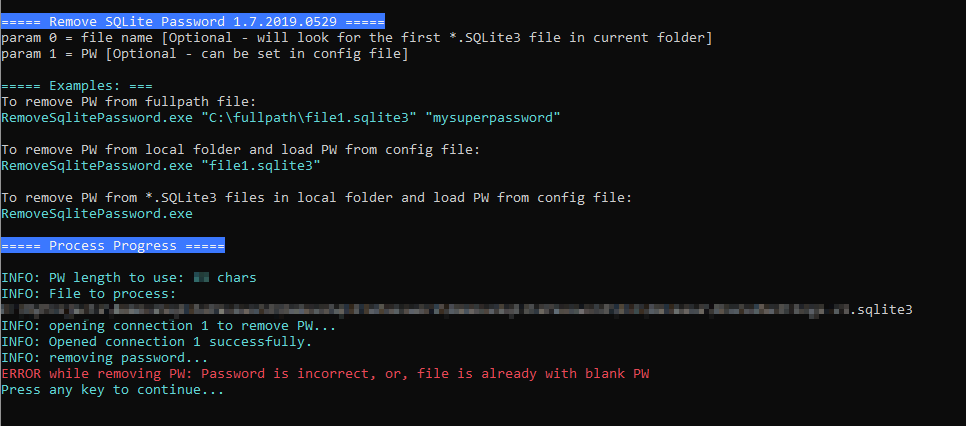

# RemoveSqlitePassword
Remove known password from SQLite database file

# Notes
1. The project uses Fody.Costura to embed these dlls into the main EXE file.
2. The project uses System.Data.SQLite dlls and embed these dlls as Embedded resource - that's why licensing is not explicitly stated.

# Screenshot

# Usage examples:

## Remove specified password from specified file:
RemoveSqlitePassword.exe "TargetDb.Sqlite" "passwordToRemove"

## Remove password from specified file, use password from config file
RemoveSqlitePassword.exe "TargetDb.sqlite"

## Remove password from all *.SQLite3 file(s) in current directory, (use password from CONFIG file)
RemoveSqlitePassword.exe
